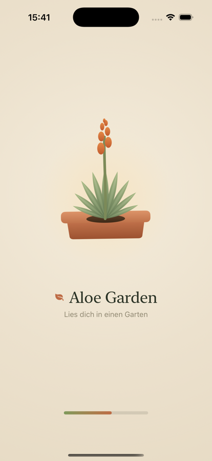
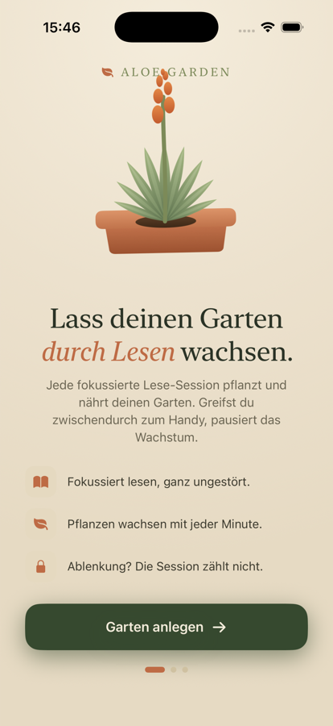
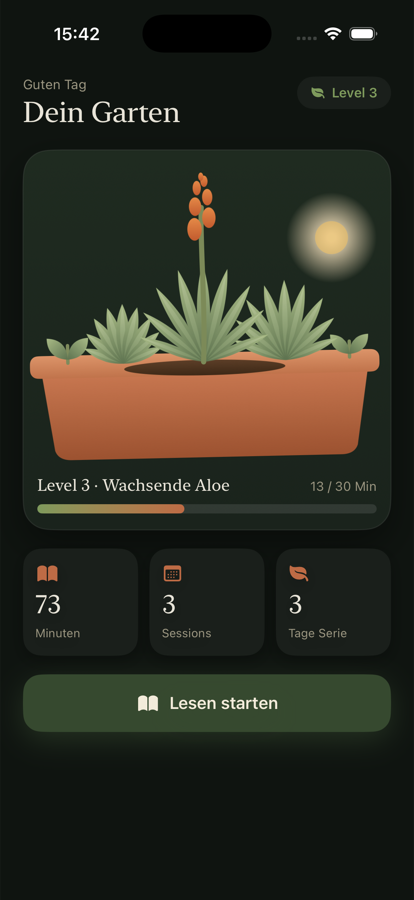

<p align="center">
  
</p>

<h1 align="center">Aloe Garden </h1>

<p align="center"><i>Lies dich in einen Garten — grow a garden by reading.</i></p>

<p align="center">
  
  
  
  
</p>

---

**Aloe Garden** is a focus-reading app for iOS. Every distraction-free reading
session waters a virtual garden that grows level by level. Pick up your phone
mid-session and the growth pauses — the session won't count. Home Screen and
Lock Screen **widgets** let you start a reading session in a single tap.

The plant artwork is drawn entirely in SwiftUI — there are no image assets for
the garden, just `Shape`s, gradients, and a little math.

##  Features

-  **A living garden** — your aloe grows and blooms as your total reading time climbs through levels.
-  **Focus sessions** — a calm, full-screen reading timer that gently discourages leaving the app.
-  **Honest by design** — leave the app during a session and it won't be credited.
-  **Real progress tracking** — current streak, weekly chart, and recent-session history, persisted locally.
-  **Home & Lock Screen widgets** — small, medium, and all three lock-screen accessory sizes. Tap to start reading.
-  **Pure SwiftUI art** — every leaf, bloom, and pot is vector-drawn.

## 📸 Screenshots

| Launch | Onboarding | Your Garden |
| :----: | :--------: | :---------: |
|  |  |  |

## 🧩 Widgets

A single widget adapts to every placement, and tapping any of them deep-links
straight into a new reading session:

- **Home Screen** — `systemSmall` and `systemMedium` showing your aloe, level, minutes, streak, and progress to the next level.
- **Lock Screen** — `accessoryCircular` (level gauge), `accessoryRectangular`, and `accessoryInline`.

Every tap opens `aloegarden://startSession`, which the app handles to launch a
focus session.

##  How it works

- **Pure SwiftUI** app, no third-party dependencies.
- The app and the **widget extension** share data through an **App Group**
  (`group.aloeGarden`).
- Completed sessions are stored as a **session log** in the App Group; totals,
  streak, and the weekly chart are derived from it, and the widget timeline is
  reloaded after every session.
- Widget taps reach the app via a custom **URL scheme** (`aloegarden://`).

##  Build & Run

Requirements: **Xcode 26+**, iOS 26 SDK.

```bash
git clone https://github.com/Tsuskov/AloeGarden.git
cd AloeGarden
open AloeGarden.xcodeproj
```

Pick the **AloeGarden** scheme and a simulator, then press **⌘R**.

To run on a **physical device** (and get live data in the widgets):

1. Set your **Team** under *Signing & Capabilities* for both the `AloeGarden`
   and `AloegardenExtension` targets.
2. Make sure the **App Group** `group.aloeGarden` is enabled on both targets
   (requires a paid Apple Developer account).
3. Enable **Developer Mode** on the device (*Settings → Privacy & Security*).

> A `DEBUG`-only seeder fills in a few sample sessions on first launch so the
> stats and widgets aren't empty while you explore. It is compiled out of
> Release builds.

##  Project layout

```
AloeGarden/            App target — SwiftUI app, garden art, focus session, stats
AloeGardenWidget/      Widget extension — Home & Lock Screen widgets
AloeGarden.xcodeproj/  Xcode project (two targets + App Group + URL scheme)
Screenshots/           Images used in this README
```

##  License

Released under the [MIT License](LICENSE).
